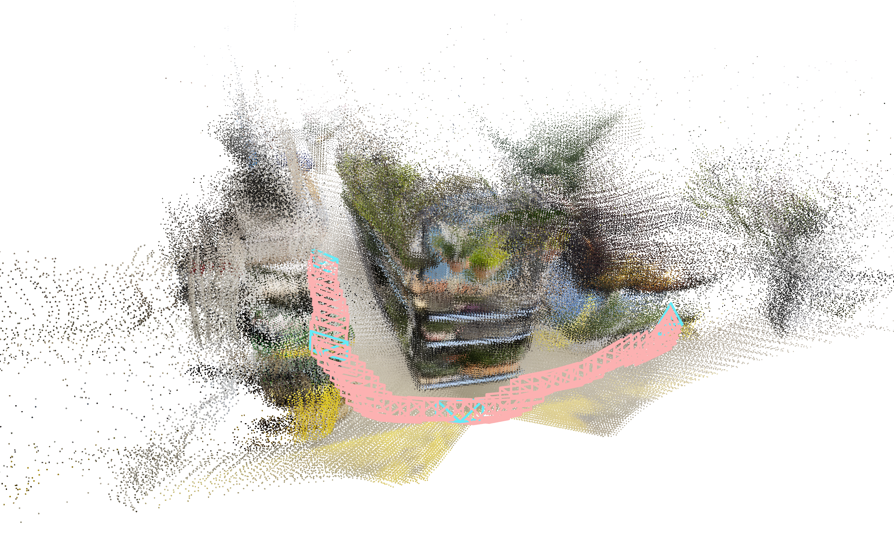
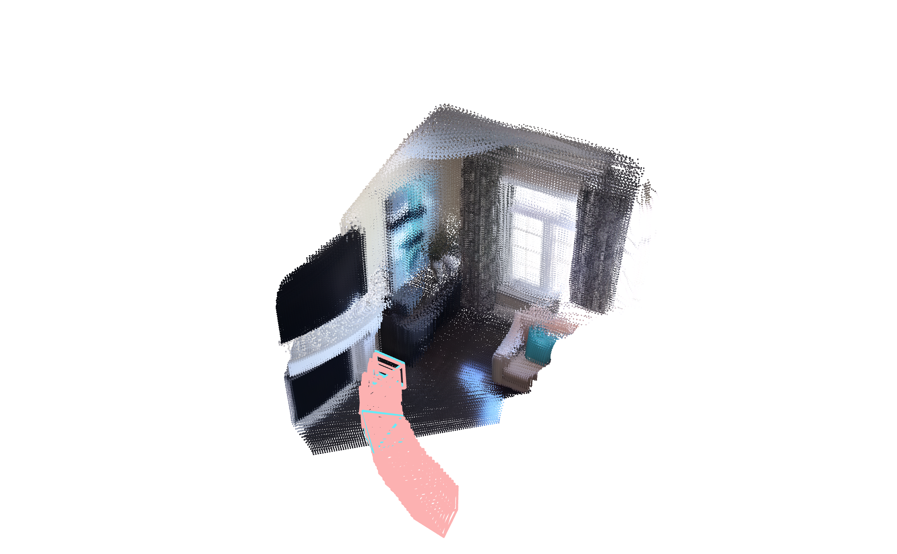
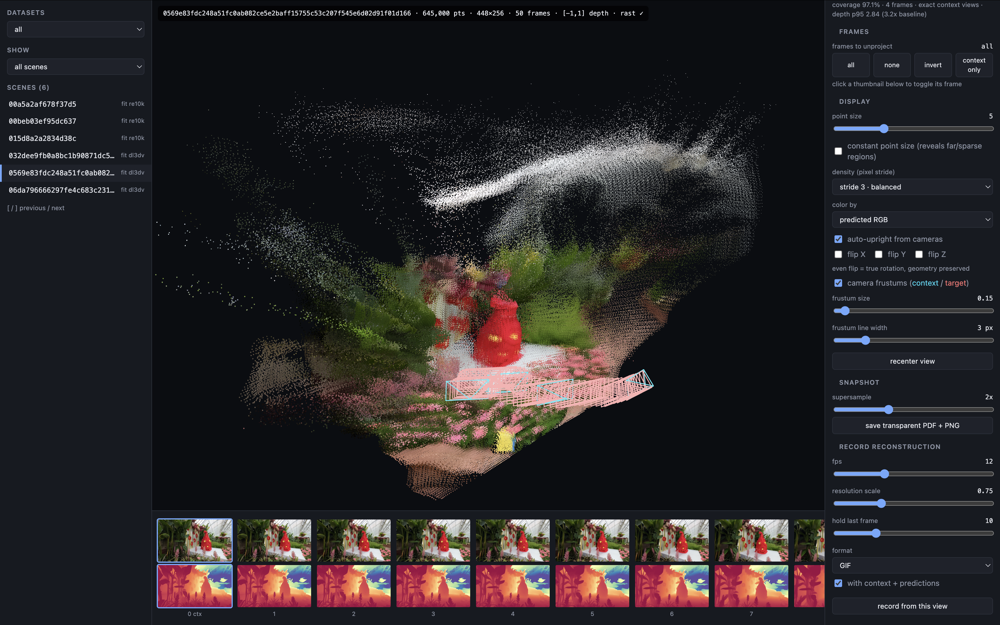

<p align="center">
  <h1 align="center">ReconSplat <br> Generalizable 3D Scene Reconstruction Beyond Observed Views </h1>
  <p align="center">
    <a href="https://www.visinf.tu-darmstadt.de/visual_inference/people_vi/visinf_team_details_147200.en.jsp">Giuseppe Stracquadanio</a><sup>1</sup>
    &nbsp;&nbsp;
    <a href="https://kevinyitshak.github.io">Kevin Raj</a><sup>1,2</sup>
    &nbsp;&nbsp;
    <a href="https://gejulia.github.io">Julia Grabinski</a><sup>1</sup>
    &nbsp;&nbsp;
    <a href="https://www.visinf.tu-darmstadt.de/visual_inference/people_vi/stefan_roth.en.jsp">Stefan Roth</a><sup>1,2,3</sup>
  </p>
  <p align="center">
    <sup>1</sup>TU Darmstadt
    &nbsp;&nbsp;
    <sup>2</sup>Zuse School ELIZA
    &nbsp;&nbsp;
    <sup>3</sup>hessian.AI
  </p>
  <h3 align="center">ECCV 2026</h3>
  <p align="center">
    <a href="https://arxiv.org/abs/2608.28895"></a>
    &nbsp;
    <a href="https://visinf.github.io/reconsplat/"></a>
    &nbsp;
    <a href="https://huggingface.co/gpstracquadanio/reconsplat"></a>
    &nbsp;
    <a href="https://www.youtube.com/watch?v=ht-JDxqBNxs"></a>
  </p>
<br>
</p>

<p align="center">
  <video src="media/videos/eccv2026_teaser_movie.mp4" controls autoplay loop muted playsinline width="100%"></video>
</p>

💡 **TL;DR:** Sparse-view 3D reconstruction is ill-posed: regression-based methods recover reliable geometry but **cannot complete unseen regions**, while generative methods synthesize plausible novel content **without corresponding geometry**.
**ReconSplat** learns a multi-view generative prior for **both appearance and geometry**. It refines observed scene evidence and jointly completes unseen RGB and depth, producing photorealistic novel views with sharp and consistent geometry.

<p align="center">
  
</p>

## ⚙️ Installation

To get started, clone this repository and run `setup.sh`, which creates a conda env (Python 3.10),
installs the required dependencies, and builds the custom CUDA rasterization kernel:

```bash
git clone https://github.com/visinf/reconsplat.git
cd reconsplat
./setup.sh              # optionally: ./setup.sh <env-name>  (defaults to "reconsplat")
conda activate reconsplat
```

<details>
  <summary><b>What <code>setup.sh</code> does, if you prefer to run the steps manually</b></summary>

```bash
conda create -n reconsplat python=3.10
conda activate reconsplat
pip install "setuptools<81"
pip install torch==2.1.2 torchvision==0.16.2 torchaudio==2.1.2 --index-url https://download.pytorch.org/whl/cu118
pip install xformers==0.0.23.post1 --index-url https://download.pytorch.org/whl/cu118
pip install -r requirements.txt
# Build the custom CUDA 3DGS rasterizer. This requires nvcc and the matching CUDA 11.8
# headers/libraries in this environment, but does not require a system-wide CUDA installation.
conda config --set channel_priority flexible
conda install -c 'nvidia/label/cuda-11.8.0' cuda-toolkit=11.8.0
# Explicitly set target GPU architectures instead of relying on torch auto-detecting a GPU, 
# only needed if you are building from a cluster login/CPU node. 
export TORCH_CUDA_ARCH_LIST="7.0;7.5;8.0;8.6;8.9;9.0" 
pip install --no-build-isolation submodules/variational-gaussian-rasterization
```

</details>

To also run `src/scripts/compute_met3r.py`, install the extra dependencies it needs:

```bash
pip install --no-build-isolation-package featup --no-build-isolation-package pytorch3d \
    -r requirements-eval-extra.txt
```

## 🗂️ Datasets

Both datasets need pre-processing before training or evaluation: see [`DATASETS.md`](DATASETS.md) for how to obtain and prepare them.

## 🧠 Pretrained models

All checkpoints are available on the Hugging Face Hub at [**gpstracquadanio/reconsplat**](https://huggingface.co/gpstracquadanio/reconsplat), which also documents the contents and training setup of each checkpoint.
Running ReconSplat requires **one checkpoint from each stage**: a Stage 1 multi-view VAE and a Stage 2 multi-view denoiser.

Download them into `checkpoints/`:

```bash
pip install -U "huggingface_hub[cli]"
hf download gpstracquadanio/reconsplat --include "stage1-vae/*" "stage2-diffusion/*" \
    --local-dir checkpoints
```

> [!NOTE]
> That pulls **every** checkpoint of both stages, (~**52 GB**). If you only want to run one
> model, look up its pair in the table below and fetch just those two files (~9 GB):
>
> ```bash
> hf download gpstracquadanio/reconsplat --include "stage1-vae/re10k.ckpt" \
>     "stage2-diffusion/re10k-upsample-ft.ckpt" --local-dir checkpoints
> ```

Each evaluation config loads the corresponding pairs:

| `+experiment=` | Stage 1 checkpoint | Stage 2 checkpoint |
| --- | --- | --- |
| `re10k_diffusion_release_upsample_ft_evals` | `stage1-vae/re10k.ckpt` | `stage2-diffusion/re10k-upsample-ft.ckpt` |
| `re10k_diffusion_release_video_ft_evals` | `stage1-vae/re10k.ckpt` | `stage2-diffusion/re10k-video-ft.ckpt` |
| `dl3dv_diffusion_release_upsample_ft_evals` | `stage1-vae/dl3dv.ckpt` | `stage2-diffusion/dl3dv-upsample-ft.ckpt` |
| `dl3dv_diffusion_release_video_ft_evals` | `stage1-vae/dl3dv.ckpt` | `stage2-diffusion/dl3dv-video-ft.ckpt` |

We also release the base models for RE10K and DL3DV, i.e., the checkpoints the fine-tuned models above continue from. Use these if you want to continue training or fine-tune your own variant:

| `+experiment=` | Stage 1 checkpoint | Stage 2 checkpoint |
| --- | --- | --- |
| `re10k_diffusion_release_evals` | `stage1-vae/re10k.ckpt` | `stage2-diffusion/re10k-base.ckpt` |
| `dl3dv_diffusion_release_ft_evals` | `stage1-vae/dl3dv.ckpt` | `stage2-diffusion/dl3dv-base.ckpt` |

## 📊 Evaluation

**Qualitative comparisons**

<p align="center">
  
</p>

<p align="center">
  
</p>

Reproduce our paper experiments by running the following command, substituting `EXPERIMENT` (i.e., which model
to load) and `INDEX` (i.e, which evaluation protocol to run) from the table below:

```bash
EXPERIMENT=re10k_diffusion_release_evals
INDEX=assets/re10k_evaluation/evaluation_index_re10k_extra_ctx2_tgt4.json

python -m src.main +experiment=$EXPERIMENT \
    mode=test \
    dataset/view_sampler=evaluation \
    dataset.view_sampler.index_path=$INDEX \
    test.compute_scores=true \
    test.save_image=true
```

An evaluation index fixes which views are inputs / context views ($N$) and which are held out / target views ($M$), so it defines
the protocol; the config selects the checkpoint pair. All indices live under `assets/`. 

| Setting | `EXPERIMENT` | `INDEX` | $N$ | $M$ |
|---|---|---|---:|---:|
| RE10K, **Interpolation** | `re10k_diffusion_release_upsample_ft_evals` | `re10k_evaluation/evaluation_index_re10k_inter_ctx2_tgt4.json` | 2 | 4 |
| RE10K, **Extrapolation** | `re10k_diffusion_release_upsample_ft_evals` | `re10k_evaluation/evaluation_index_re10k_extra_ctx2_tgt4.json` | 2 | 4 |
| DL3DV, $N_{traj}=150$ | `dl3dv_diffusion_release_ft_evals` | `dl3dv_evaluation/evaluation_index_ctx4_tgt4_n150.json` | 4 | 4 |
| DL3DV, $N_{traj}=300$ | `dl3dv_diffusion_release_ft_evals` | `dl3dv_evaluation/evaluation_index_ctx4_tgt4_n300.json` | 4 | 4 |

Results are written per scene under `test.output_path`:

```
<output>/<scene>/
    color/<idx>.png          predicted novel views
    depth/<idx>.png|.pt      predicted novel view depth (colorized, and raw tensors)
    color_gt/ depth_gt/      ground truth (if available)
    context_image_<idx>.png  context views
    cam_dict/cameras.torch   intrinsics, extrinsics, view indices
    results.json             per-scene PSNR / SSIM / LPIPS / DISTS
```

> [!TIP] `test_step` skips any scene that already has a `results.json`, so an interrupted evaluation resumes by re-running the same command.

### 📈 Other metrics

`src/scripts/fid_score_predictions.py` computes FID over exported prediction
folders, and `src/scripts/compute_met3r.py` scores multi-view consistency (needs the extra dependencies from the Installation section).

### 🎥 Rendering trajectories

Use a video index together with a `-video-ft` checkpoint:

```bash
python -m src.main +experiment=re10k_diffusion_release_video_ft_evals \
    mode=test \
    dataset/view_sampler=evaluation \
    dataset.view_sampler.index_path=assets/re10k_evaluation/re10k_sub100_scenes_video_ctx_in_target.json \
    test.save_video=true test.save_image=true test.compute_scores=false
```

| Setting | `EXPERIMENT` | `INDEX` | $N$ | $M$ |
|---|---|---|---:|---:|
| RE10K trajectories (limited to 100 scenes) | `re10k_diffusion_release_video_ft_evals` | `re10k_evaluation/re10k_sub100_scenes_video_ctx_in_target.json` | 2 | 32–50 |
| DL3DV trajectories | `dl3dv_diffusion_release_video_ft_evals` | `dl3dv_evaluation/dl3dv_start_0_distance_50_ctx_4v_video_0_50.json` | 4 | 50 |

In all our qualitative video results, the full trajectory fits into a single denoising window, so every target view is denoised jointly and no chunking is involved.

<details>
  <summary><b>If a trajectory does not fit in memory</b></summary>

For longer trajectories, or on GPUs where a whole trajectory does not fit at once,
`test.sample_in_chunks=true test.chunk_size=<CHUNK_SIZE> test.chunk_overlap=<OVERLAP_BETWEEN_CHUNKS>` denoises the targets in windows instead. However, we have *not* verified that this strategy produces similar qualitative results.

</details>

### 🔬 Novel-view depth synthesis

ScanNet++ is used **only for evaluation**, to assess the accuracy of depth predictions against real ground-truth depth; it is never used for training. We provide an evaluation index with $N=4$ context views and $M=90$ target views for 12 scenes from the test split at `assets/scannet.json`.

To reproduce our evaluation, run:
```bash
# The output path will contain a summary with PSNR/SSIM/LPIPS/DISTS metrics. 
python -m src.main +experiment=dl3dv_diffusion_release_upsample_ft_scannet_evals \
    mode=test \
    dataset.roots=[path/to/your/scannet++] \
    dataset/view_sampler=evaluation \
    dataset.view_sampler.index_path=assets/scannet.json \
    test.output_path=outputs/<your scannet eval>

# To compute depth metrics, run:
python -m src.scripts.compute_metrics_reconsplat --root outputs/<your scannet eval>
```

## ☁️ Point clouds from predicted depth

<table>
  <tr>
    <td width="50%"></td>
    <td width="50%"></td>
  </tr>
</table>

The model predicts normalized depth in the fixed range [-1, 1]. During training, depth maps are normalized to this range before being encoded into latents, and the diffusion model operates entirely in this normalized space. See Section D.2 of our [paper](https://arxiv.org/abs/2608.28895) for details.

As a result, the decoded depth predictions cannot be directly unprojected into a geometrically correct point cloud. The camera poses are expressed in a fixed coordinate system, while the predicted depth is still normalized. Combining the two directly can distort the reconstruction, for example by collapsing points toward the camera centers.

Before unprojection, we therefore recover a scene-specific depth range by fitting a log-affine transformation

$\log(d') \approx a \cdot d + b$

where $d$ is the normalized depth prediction and $d'$ is the depth aligned to the reference scale. The fitted parameters $a$ and $b$ map the prediction to a depth range consistent with a reference depth for the same scene.

Note that this does not recover metric scale. The reference depth is itself non-metric, so the goal is to recover the correct scene geometry in the camera coordinate system rather than the true physical size of the scene.

For the reference, we use depth at the context views, i.e., the input views provided to ReconSplat. These depths can be obtained from either:
- the dataset depth pseudo-labels **for context views**, when available; or
- a depth prediction from VGGT, run **only on the context views**.

Therefore, this procedure does not require ground-truth depth and can be applied to new scenes entirely at inference time.

To fit the log-affine transformation, we need ReconSplat depth predictions at the context views themselves. The recommended way to obtain them is to include the context views in the target set during rendering: `dataset.view_sampler.include_context_in_target=true`.
This keeps the usual target trajectory unchanged while additionally rendering the context views needed for scale fitting.
### ✅ Recommended: fit the depth scale during rendering
Scale fitting can be run automatically once rendering finishes by enabling `test.fit_pcd_scale=true`.

For example:
```bash
python -m src.main +experiment=re10k_diffusion_release_video_ft_evals \
    mode=test \
    dataset/view_sampler=evaluation \
    dataset.view_sampler.index_path=assets/re10k_evaluation/re10k_extrapolation_top_100_supplement_video.json \
    dataset.view_sampler.include_context_in_target=true \
    test.sample_in_chunks=true test.chunk_size=64 test.chunk_overlap=4 \
    test.save_image=true test.compute_scores=false \
    test.fit_pcd_scale=true
```

The scale fit uses a reference depth for the context views:
- if the evaluation was run with `dataset.load_depth_labels=true`, the saved context-view depth pseudo-labels are used;
- otherwise, a single VGGT forward pass is run on the context images.

The VGGT option also masks _sky_ regions before fitting, since their arbitrary depth estimates can otherwise adversely affect the alignment.

Once rendering finishes, the fitted log-affine parameters are stored in `scale_fit.json`, and the reconstruction can be opened directly in our point-cloud viewer.

### 🌐 Browse the reconstructed point clouds

<p align="center">
  
</p>

```bash
python -m src.scripts.pcd_web_viewer \
    --dataset re10k=outputs/<your re10k video eval> \
    --dataset dl3dv=outputs/<your dl3dv video eval> \
    --port <PORT>
```
The viewer is available at `http://localhost:<PORT>`. If the results are stored on a remote machine, tunnel the port first. The viewer lets you do some stuff, like adjusting the fitted scale, controlling point size, toggling camera frustums, and recording the progressive reconstruction as a GIF or MP4.

<details>
<summary><b>Alternative: fit the scale after rendering</b></summary>

If predictions were rendered without automatic scale fitting, you can fit the log-affine transformation afterward. The rendered target set must include the context views, either by setting

`dataset.view_sampler.include_context_in_target=true`

during rendering, or by using one of the provided `*_ctx_in_target.json` evaluation indices.

### 🔎 Using context-view depth

Run:

```bash
python -m src.scripts.fit_context_scale \
    --root outputs/<your video eval output>
```

The script uses saved context-view depth pseudo-labels when available, and otherwise obtains the reference depth from VGGT predictions on the context views.

Useful options include:

* `--no-context-vggt` to disable the VGGT pass on the context views. Scenes without saved depth pseudo-labels are then skipped.
* `--no-sky-mask` to disable sky masking before fitting.

### 🌀 Using Gaussian-rasterized depth

Gaussian-rasterized depth can also be used as a reference. However, it is generally *weaker* than VGGT, especially on DL3DV.

First export the rasterized depth:

```bash
python -m src.scripts.export_rasterized_depth \
    --experiment re10k_diffusion_release_video_ft \
    --index assets/re10k_evaluation/re10k_sub100_scenes_video_ctx_in_target.json \
    --out outputs/<your video eval> \
    --num-context-views 2
```

Then run the same fitting script to compute log-affine parameters:

```bash
python -m src.scripts.fit_context_scale \
    --root outputs/<your video eval>
```

`fit_context_scale.py` detects the exported rasterized depths automatically and adds the corresponding fit to the point-cloud viewer. `--rasterized-depth-all` fits the transformation against rasterized depth over **all target views**, rather than only the context views. 

After fitting, open the results with `pcd_web_viewer` as described above.
</details>

## 🚀 Training

Note that training requires processing the datasets to generate depth pseudo-labels from a geometric
foundation model first: see [Processing the data](DATASETS.md#processing-the-data).

We recommend setting `precision: 32-true` when training, since we have observed divergence with `bf16-mixed` when training our diffusion model. Our training scripts and dataloaders are compatible with multi-GPU training. `data_loader.train.batch_size` sets the per-GPU batch size.

### 1️⃣ Stage 1 — multi-view latent field

Run the following to reproduce our Stage 1 training.

`+experiment=re10k_vae` needs the original MVSplat checkpoint to initialize the multi-view encoder
weights. Download it following [MVSplat's evaluation instructions](https://github.com/donydchen/mvsplat#evaluation)
and save it as `checkpoints/mvsplat/re10k.ckpt`.

```bash
# RE10K
python -m src.main +experiment=re10k_vae \
    wandb.name=my_re10k_vae_run

# DL3DV: initialized from the RE10K VAE.
# Defaults to our released checkpoint (checkpoints/stage1-vae/re10k.ckpt); to use your own RE10K
# VAE run instead, override checkpointing.load_first_stage=path/to/your/checkpoint.
python -m src.main +experiment=dl3dv_vae \
    wandb.name=my_dl3dv_vae_run
```

### 2️⃣ Stage 2 — multi-view latent diffusion

The table below shows the Stage 2 checkpoint hierarchy: `Init. from` names the checkpoint each config starts from. *N* is the number of context views, *M* the number of target views. The `-video-ft` runs train only the temporal (3D convolution) blocks and freeze everything else; the `-upsample-ft` runs halve the effective downsampling factor (*f* = 8 → 4) by  2× bilinearly upsampling views.

| Config | Init. from | N | M | Per-GPU batch | Training steps |
|---|---|---:|---:|---:|---:|
| `re10k_diffusion_release` (RE10K base) | SD 2.1 | 2 | 4 | 10 | 200K |
| `re10k_diffusion_release_upsample_ft` | RE10K base | 2 | 4 | 3 | 50K |
| `re10k_diffusion_release_video_ft` | RE10K base | 2 | 10 | 4 | 100K |
| `dl3dv_diffusion_release_ft` (DL3DV base) | RE10K base | 4 | 4 | 4 | 140K |
| `dl3dv_diffusion_release_upsample_ft` | DL3DV base | 4 | 4 | 1 | 50K |
| `dl3dv_diffusion_release_video_ft` | DL3DV base | 4 | 10 | 3 | 100K |

Launch any config in the table above the same way, substituting its name. This example trains the RE10K base model:

```bash
# For the RE10K base model.
python -m src.main +experiment=re10k_diffusion_release \
    wandb.name=my_re10k_base_run
```

> [!IMPORTANT]
> Make sure `checkpointing.load_first_stage` points to the corresponding Stage 1 checkpoint (i.e.,
> the `re10k_vae` output for all RE10K models, the `dl3dv_vae` output for all DL3DV models).
> To train a fine-tune, also point `checkpointing.load_second_stage` at the checkpoint of the model
> named in its `Init. from` column.

To resume an interrupted run, keep the same `wandb.id` (recommended) and pass the in-progress checkpoint, e.g.,:

```bash
python -m src.main +experiment=re10k_diffusion_release \
    checkpointing.resume=true \
    checkpointing.load_second_stage=checkpoints/ldm/<run>/epoch_0-step_4000.ckpt
```

Experiment logging is done via `wandb`; set `wandb.entity`/`wandb.project` in `config/main.yaml`, or pass `wandb.mode=disabled` to turn it off.

## 📁 Repository structure

The main entry points and directories are:

```text
reconsplat/
    config/                    # Hydra configuration files
        experiment/            # Training and evaluation configs (+experiment=...)
        dataset/               # Dataset and view-sampler configs
        model/                 # Model architecture configs
        main.yaml              # Root configuration

    src/
        main.py                # Main training/evaluation entry point (python -m src.main)
        model/                 # Model architectures and components
        dataset/               # Dataset loaders and view samplers
        scripts/               # Standalone tools for point clouds, pseudo-labels, metrics, etc.
        evaluation/            # Evaluation metrics and index generation
        labels/                # Pseudo-label generation and third-party model wrappers
        misc/                  # Shared utilities for I/O, benchmarking, and depth/image processing
        visualization/         # Camera trajectories, color maps, and rendering utilities

    assets/                    # Evaluation indices and auxiliary assets
    submodules/                # Custom CUDA 3DGS rasterizer
    setup.sh                   # Sets up the environment and builds the CUDA rasterizer
```

## 📚 BibTeX

```bibtex
@article{stracquadanio2026reconsplat,
    title   = {{ReconSplat}: {G}eneralizable {3D} scene reconstruction beyond observed views},
    author  = {Stracquadanio, Giuseppe and Raj, Kevin and Grabinski, Julia and Roth, Stefan},
    journal = {{ECCV}},
    year    = {2026},
}
```

## 🙏 Acknowledgements

This codebase is based on [latentSplat](https://github.com/Chrixtar/latentsplat), [MVSplat360](https://github.com/donydchen/mvsplat360), [MV-LDM](https://github.com/mohammadasim98/mv-ldm), [VGGT](https://github.com/facebookresearch/vggt) and [VDA](https://github.com/DepthAnything/Video-Depth-Anything). We deeply thank the authors of these projects for open-sourcing their codebase!
